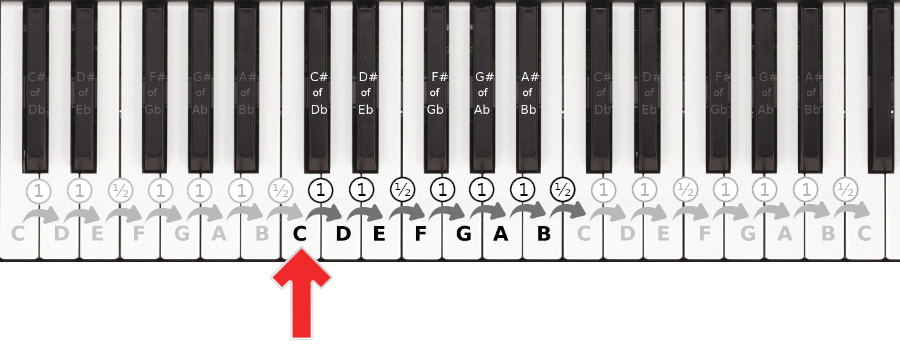
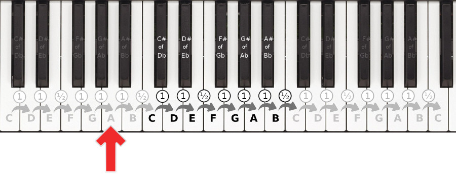

# Sines as Notes

> I. 十二平均律——标准音A(440Hz)

a. Why <math xmlns="http://www.w3.org/1998/Math/MathML"><mroot><mn>2</mn><mn>12</mn></mroot></math> or <math xmlns="http://www.w3.org/1998/Math/MathML"><msup><mn>2</mn><mfrac><mn>1</mn><mn>12</mn></mfrac></msup></math>


由上图（Plomp, R. and Willem J. M. Levelt. “Tonal consonance and critical bandwidth.” The Journal of the Acoustical Society of America 38 4 (1965): 548-60），六个和谐音程中1/2、2/3和3/4分母最小公倍数为12。十二平均律是人类不断实践并为[朱载堉](https://zh.wikipedia.org/wiki/%E5%8D%81%E4%BA%8C%E5%B9%B3%E5%9D%87%E5%BE%8B)所集大成者。且除整数倍频外，当属```1.5```倍频最为和谐（这与下文的五度相生关系密切）。而<math xmlns="http://www.w3.org/1998/Math/MathML"><msup><mn>2</mn><mfrac><mn>1</mn><mn>12</mn></mfrac></msup></math>正是为了确保每个（半）音距离十二个（半）音之后出现其二倍频（或半频）：<math xmlns="http://www.w3.org/1998/Math/MathML"><msup><mn>2</mn><mfrac><mrow><mi>n</mi><mo>+</mo><mn>12</mn></mrow><mn>12</mn></mfrac></msup><mo>&#xA0;</mo><mo>&#xF7;</mo><mo>&#xA0;</mo><msup><mn>2</mn><mfrac><mi>n</mi><mn>12</mn></mfrac></msup><mo>&#xA0;</mo><mo>=</mo><mo>&#xA0;</mo><mn>2</mn></math>

<br>

b. 七音阶八度与十二平均律




 
```
大调：全全半全全全半（12个半音）

小调：全半全全半全全（12个半音）
```

<br>

c. Keys of Piano and Frequency


[test](https://academo.org/demos/virtual-oscilloscope/)

<br>

d. programming to generate notes

```C51
// ref. Song's book page 140

#include <reg52.h>

sbit BUZZ = P1^6;  
unsigned char T0RH = 0;  
unsigned char T0RL = 0;  

void OpenBuzz(unsigned int frequ);
void StopBuzz();

void main()
{
    unsigned int i;
    
    TMOD = 0x01;  
    EA = 1;       
    
    while (1)
    {
        OpenBuzz(32000);         
        for (i=0; i<40000; i++);
        StopBuzz();              
        for (i=0; i<40000; i++);
        OpenBuzz(1000);          
        for (i=0; i<40000; i++);
        StopBuzz();            
        for (i=0; i<40000; i++);
    }
}

void OpenBuzz(unsigned int frequ)
{
    unsigned int reload;    
    
    reload = 65536 - (11059200/12)/(frequ*2);  
    T0RH = (unsigned char)(reload >> 8);  
    T0RL = (unsigned char)reload;
    TH0  = 0xFF;  
    TL0  = 0xFE;
    ET0  = 1;     
    TR0  = 1;     
}

void StopBuzz()
{
    ET0 = 0;   
    TR0 = 0;   
}

void InterruptTimer0() interrupt 1
{
    TH0 = T0RH;   
    TL0 = T0RL;
    BUZZ = ~BUZZ; 
}
```

> II. 五度相生律——Pythagorean Tuning


Comparison of equal-tempered (black) and Pythagorean (green) intervals showing the relationship between frequency ratio and the intervals' values, in cents.

<br>


[大调和小调的感受](https://muted.io/circle-of-fifths/)

> III. 音乐的性格


demos by chronmonica

