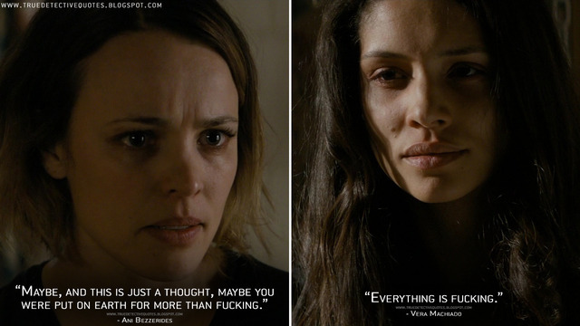

# 小资产阶级跃升为资产阶级之路径刍议

真探第一季口碑远高于第二季，恰恰说明了剧集之外的真实世界和剧中一样处于黑暗的笼罩之下。拉斯特，在我看来，一直在叔本华和尼采之间摇摆，甚至不能把握尼采永恒轮回内含的生成性方面，终究未能从形而上学进入观念论，遑论主体的主体化。而第二季用弗兰克·谢苗的失败直击资本主义的权力本质，已然进入了实践理论。所以第一季更像是奇观电影，第二季是纪录片，自有其先进性。  
弗兰克·谢苗的名字取自于一个合法马克思主义者(Legal Marxist) -- Semyon Ludwigovich Frank。Semyon与Semen（精液）同音，剧中弗兰克不能令其妻子受孕。他相信其精子有效性，但对能增强其精子流动性的精液持怀疑态度。  
要想富，先修路，少生孩子多养猪。可见土地与土地之间的价值差异在于在其之上之产出的流动性差异。可悲的是流动性异化为纯粹数字之后继而进一步异化生产，产生金融资本主义，形成金融资产阶级，即人格化的金融资本。金融资本家对产业资本家的剥削在平台经济踌躇满志的今天已经司空见惯。

>“江浙人特别聪明，以前电视剧时代就是看谁拍得好，谁收视率高，所以大家就会研究收视率高的作品怎么去拍，包括一些打擦边球、剧情比较狗血，但到了一些江浙人介入这个行业以后，他们会想电视剧的买卖是最后靠什么结算？——按收视率结算，所以我直接买收视率不就行了。他们就是天生的生意人，算是给影视行业带来了一场“思维革命”，直奔最关键的要素。”（汪海林）

类似的还有卢员外口中的白手套--郑爽们，以及高校按影响因子结算不一而足。 流动性的流也正是流量的流。  
说回到弗兰克，其对流动性的疑惑恰恰表明其小资产阶级的幼稚属性，其一方面唯恐阶级跌落，另一方面又希冀着阶级跃升，同时却并不理解由小资产阶级的顶层跃升至资产阶级底层的路径何在（我理解的阶级层级并非层次分明，而是一个渐变的连续谱，此处只是为了方便快速的说明）。那终极一跃往往并不存在于其“自我”的符号学系统生成范式之中。  
小资产阶级的符号学系统是按照资产阶级的意旨经由意识形态生成的，往往就是一系列的标签和层级分明的数字化符号鄙视链。职高--普高优高--普高重高--少年班提前录取...、助教--讲师--副教授--教授--二级教授...、本科--硕士--博士--985本硕博...、公寓--叠排--别墅--两套别墅...、高碎--雨前--明前--半手工群体种--一万八一斤大师纯手工...、6A--6B--6C--5A--5B--5C...。仅举这几例，请原谅一个脑力无产者的浅见。  
小资产阶级作为一个阶级，如勉强能看成是一个阶级的话，因其向来不是一个自为的阶级，而只是自在的阶级，后者恰恰是其作为资产阶级利用工具的关键属性，其功能实质是资产阶级对底层普罗大众吸血用的吸管。如平台算法工程师新开发的高级算法不知会让多少外卖员折寿，当平台获取到实质流动性成效后，工程师便会立即如愿从其主人处拿到自己的份额。当拿到足够壮胆和足够高期望的份额后，经常是加杠杆置办房产，幸运者通过房产（一种金融资本）的流动性获益，更多的是在全社会整体份额下降时成为牺牲品，瞬间实现阶级跌落。吸管？夜壶？  
其中一定要有所谓杰出者脱颖而出成为资产阶级的金牌代理人直到也能上桌（视其对权力的理解而定），这对尚未跃升者是一种至高的激励，是奋斗逼的精神动力。这也与前述符号鄙视链相合。  
但究竟什么是杰出以及如何成为杰出？小资产阶级普遍幼稚的以为这是一项技术性活动。空姐和地勤从技术层面上来讲没有任何层阶差别，工种不可跨越何解？无非身材、相貌而已，这两样显而易见是意识形态建构的可以细分的满足权力者爱欲享乐的一种增殖性符号，并非什么了不得的东西，与技术无关。当弗兰克多年的积蓄不知所终时，最先想到的办法就是重回地下，用老办法（技术，即暴力）重整旗鼓。甚至在知悉坑他的人们都是在市长之子托尼攒的权力色情高端局上推杯换盏后，他的做法是对其进行肉体消灭。这就是典型的不得其门而入。
技术属于物的范畴，小资产阶级总是误以为一切问题都可通过操控物来解决，一切目标都可借由物来抵达，这是小资产阶级无法成为自为阶级的根本原因。只有剧中那位高级妓女点明了不二法门--昆明四季如春。  
  
当然，fucking只是派生物，如此这般的爱欲享乐表现形式还有很多（妓女能够加以利用的最容易想到的自然就是fucking），凡此种种莫不是根源于权力。  

>正是权力才是阶级跃迁的本质。

>既是企图跃迁者，自不具备权力，故此处所指之权力在于取悦于权力，即满足权力者的爱欲享乐。这是最为直接的人与人的支配与被支配的关系，并非人与物的关系，或者说是异化的人与物化的人的关系。

弗兰克至死不能理解的正是这一点，最后终因不愿褪下西装（尊严）取悦权力而死。为尊严而死也算死得其所。显然他不是资本眼中合格的宿主，无法实现那终极一跃--资本的人格化、人的异化。反观托尼--市长的儿子，为了完成那一跃，可以手刃市长（亲情）。这才是资本实现自身增殖的合格宿主。  

>资产阶级在它已经取得了统治的地方把一切封建的、宗法的和田园诗般的关系都破坏了。它无情地斩断了把人们束缚于天然尊长的形形色色的封建羁绊，它使人和人之间除了赤裸裸的利害关系，除了冷酷无情的“现金交易”，就再也没有任何别的联系了。它把宗教虔诚、骑士热忱、小市民伤感这些情感的神圣发作，淹没在利己主义打算的冰水之中。它把人的尊严变成了交换价值，用一种没有良心的贸易自由代替了无数特许的和自力挣得的自由。总而言之，它用公开的、无耻的、直接的、露骨的剥削代替了由宗教幻想和政治幻想掩盖着的剥削。--《共产党宣言》

“你是谁呀？小资。一个唯利是图、走私逃税的小资。不要把自己看得这么重。毙了他，我就依法办事”--《树大招风》。此后，叶国欢送上了最后一个花瓶。后终因重操旧业而落网。这是另一个弗兰克的故事。