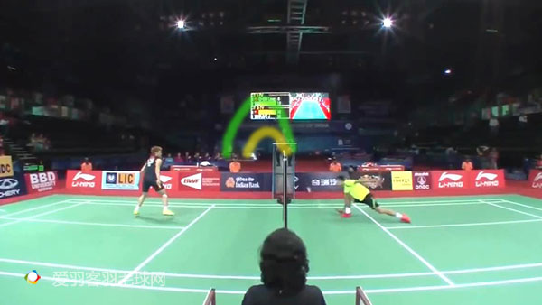

# Tago's Far Net Shot
  
<strong>（转载）</strong>https://www.aiyuke.com/news/2018/02/nb6a9c406bf6.html  
爱羽客菜师兄在观看田儿贤一比赛的时候发现这是一位非常喜欢使用网前“高放”技术的球手。“高放”是一个既有观赏性又有实用价值的技术，但对手感和心理要求很高，今天就借田儿师兄的素材来聊聊这门控网利器：`高放`技术。  

一、什么是高放  
>过网弧度高+不追求球头旋转的放网  

  
$\Uparrow$ tago高放网前  

  
$\Uparrow$ 绿色轨迹弧度高为“高放”；黄色轨迹弧度低为“低放”  

>高放的目的不是擦网而过，而是贴网下坠  

  
$\Uparrow$ tago高放，谌大跨步上网挑球  
高放和低放（正常放网）最大的区别就是过网弧度不同。弧度越高球前飞的趋势越少。这也是高放的终极目的：过网即坠。

二、什么时候使用高放  
>远网转近网  

  
$\Uparrow$ 谌挡远网，tago高放，谌大跨步上网挑球  

  
$\Uparrow$ tago接杀高放  

  
$\Uparrow$ 近网不要高放，对手网前看得很紧  

并不是什么时候都可以选择“高放”。一般来说远网“转”近网时使用“高放”居多。在近网的博弈中，切忌使用“高放”，因为"高放”节奏偏慢，很容易被对手抓死。而远网球对手出球后一般不会选择扑球，这就给你了“高放”的空间。  

三、高放的要点  
>无需手指动作+只需手臂、手指的轻重感觉  

  
$\Uparrow$ tago写意的高放  

“高放”技术本身并不复杂，就是把球“碰”出一个高弧度过网球，高点在本方半场。手指上也无需多余动作，结合手臂类似颠球。高放的难点还是在轻重的感觉以及心理上。

